<h1 align="center">SYAHID SUBHAN PUTRA — GitHub Profile Card</h1>

<p align="center">
  
</p>

<p align="center">
  <strong>Open-source • Terminal UI • ASCII avatar • Live GitHub stats</strong>
</p>

<p align="center">
  A custom GitHub profile card generator built from the original open-source template,
  redesigned into a cleaner futuristic terminal interface rather than a direct replica.
</p>

## What changed

- Reworked the visual system from the original Kali-style card into a custom graphite / cyan / amber interface.
- Uses the supplied hacker artwork as the source for the ASCII portrait.
- Replaced the old duplicated generator logic with one maintained generator plus a compatibility entry point.
- Added deterministic fallback artwork when no avatar exists.
- Added safer GitHub API handling with graceful `—` fallbacks instead of failing the build.
- Added repository pagination so profiles with more than 100 repositories are not silently truncated.
- Added a real GitHub Actions workflow that regenerates the SVG on push, on schedule, or manually.
- Added `requirements.txt` so local and Actions installs use the same dependency list.
- Added reduced-motion support and a static-render-safe design so the card remains readable when SVG animation is not executed by a renderer.
- Kept the generated card self-contained: no JavaScript and no external runtime assets are required.

GitHub supports profile READMEs and lets you pin repositories/gists to make your work easier to discover.

## Project structure

```text
.
├── .github/
│   └── workflows/
│       └── generate-card.yml
├── assets/
│   ├── avatar.jpg
│   ├── profile.svg
│   ├── profile_v2.svg
│   └── ...
├── scripts/
│   ├── generate_card.py
│   └── generate_card_v2.py
├── CONTRIBUTING.md
├── GALLERY.md
├── LICENSE
├── README.md
└── requirements.txt
```

## Setup for a GitHub profile

The profile card is designed to live in a repository named exactly the same as your GitHub username. GitHub then displays that repository's `README.md` at the top of your profile.

### 1. Create the profile repository

Create a public repository with the same name as your GitHub username, for example:

```text
your-username/your-username
```

### 2. Put this project in the repository

Upload the project files and keep the directory structure intact.

### 3. Commit and push

The workflow automatically reads the repository owner as `GITHUB_LOGIN`, so you do not need to edit the username inside the workflow. It also receives GitHub's built-in `GITHUB_TOKEN` automatically; no personal access token needs to be committed to the repository.

### 4. Add the card to your profile README

The workflow generates:

```text
assets/profile.svg
```

and commits it back to `main` when the generated file changes.

Use a relative image path when the SVG is in the same profile repository:

```md
<p align="center">
  
</p>
```

GitHub supports relative image paths in rendered README files, which keeps the profile portable when the repository is cloned or moved.

## Customize the profile

The default identity is already set to:

```text
SYAHID SUBHAN PUTRA
```

You can customize the remaining values through environment variables instead of editing the generator internals.

| Variable | Default | Purpose |
| --- | --- | --- |
| `GITHUB_LOGIN` | `your-username` | GitHub username used for live stats |
| `PROFILE_NAME` | `SYAHID SUBHAN PUTRA` | Display name |
| `PROFILE_BRAND` | `HIDZ PROJECT` | Footer / brand text |
| `PROFILE_ROLE` | `Web Developer & Security Enthusiast` | Main role line |
| `PROFILE_LOCATION` | `Indonesia` | Location line |
| `PROFILE_WEBSITE` | empty | Optional website text |
| `PROFILE_CONTACT` | empty | Optional contact text |
| `AVATAR_PATH` | auto-detected | Avatar source image |
| `OUT_PATH` | `assets/profile.svg` | Generated SVG path |

The supplied `assets/avatar.jpg` is already configured as the default avatar source.

## Local development

Requires Python 3.12+.

```bash
python -m pip install -r requirements.txt
```

Then:

```bash
export GITHUB_LOGIN="your-username"
python scripts/generate_card.py
```

For live contribution totals, the generator can use the GitHub Actions token or another GitHub token supplied through `GITHUB_TOKEN`. If the API is unavailable, the generator still writes a valid card and uses `—` for unavailable statistics.

## Why there are two generator files

`generate_card.py` is the maintained implementation.

`generate_card_v2.py` remains as a compatibility entry point for projects that already referenced the old filename. It delegates to the maintained generator instead of keeping a second divergent implementation.

## Validation checklist

Before packaging this version, the generator was checked for:

- Python syntax errors with `py_compile`.
- Valid SVG/XML structure with an XML parser.
- Successful SVG generation from the supplied avatar.
- Successful static SVG rasterization for visual inspection.
- Missing GitHub username / unavailable API fallback behavior.
- Clean generated output path creation.
- GitHub Actions workflow presence and write permissions.

GitHub recommends keeping profile content focused on the work, projects, skills, and links you want visitors to discover.

## License

The original project license is retained in `LICENSE`. Review that file before redistributing modified versions of the template.

## Credits

This version is a substantial visual and implementation redesign of the supplied open-source `ascii-profile-card` project. It intentionally keeps the useful concept—an SVG-based terminal profile card—while changing the composition, information hierarchy, colors, fallback behavior, and workflow structure.
