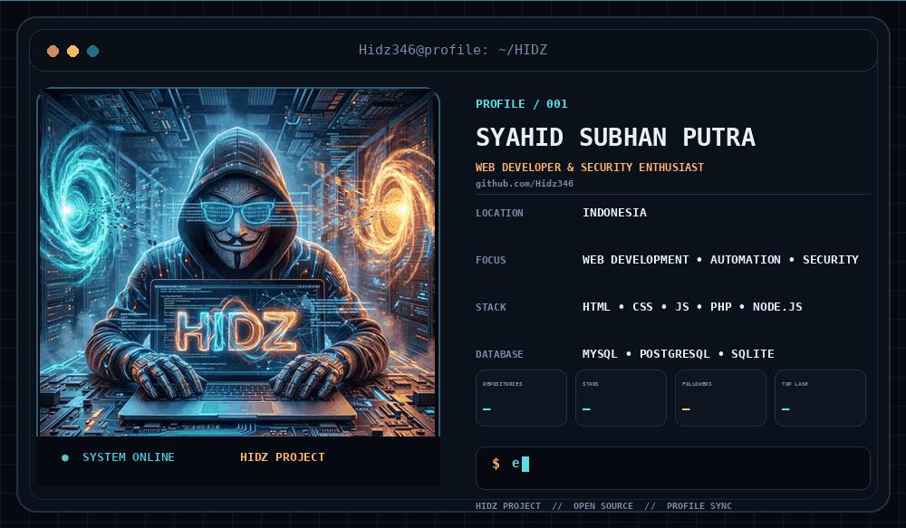

<table width="100%">
<tr>
<td width="55%" align="center" valign="middle">

<h1>
  Hi , I'm SYAHID SUBHAN PUTRA
</h1>

<h3>
  Web Developer • Builder • Creator
</h3>

  

  
  
  

</td>
<td width="45%" align="center" valign="middle">

</td>
</tr>
</table>

  
  
  
  
  
  
  
  
  
  
  
  
  
  
  
  
  
  
  
  
  

###

  <h2>Connect with me</h2>
  

###

## ⚡ What I Build

- 🌐 Modern websites and web applications
- 🧩 Developer tools and utilities
- ☁️ Hosting and deployment projects
- 🎵 Music and media web experiences
- 🔐 Authentication and account systems
- 🎨 Custom interfaces, animations, and interactive UI

## 🚀 HIDZ PROJECT

**HIDZ PROJECT** is my personal project ecosystem for building and experimenting with web-based products, tools, and digital experiences.

| Project | Description |
| --- | --- |
| **HidzHost / HidzHosting** | Hosting and file-sharing projects built around uploads, generated links, and deployment. |
| **HIDZ MUSIC** | Music streaming experience with lyrics, playlists, search, and responsive playback. |
| **HIDZ PROJECT Web** | Personal platform combining modern UI, authentication, account management, and interactive experiences. |

###

  
  

###

  

  

---

### HIDZ PROJECT

**DESIGN • CODE • BUILD • IMPROVE**

